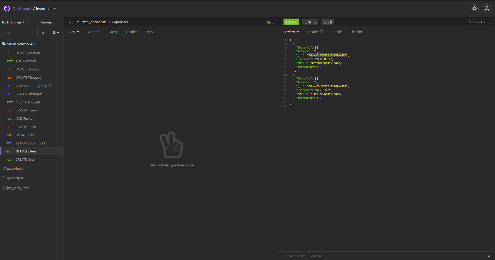

# Social Network API
  

  ## Description:
  The backend for a social media API. Used to create Users, Thoughts, and reactions to those thoughts.

  ---

  ## Table of Contents:
  * ### [Installation](#installation)
  * ### [Usage](#usage)
  * ### [Contributors](#contributors)
  * ### [License](#license)
  * ### [Questions](#questions)

---

  
## Installation:
#### Clone Repository -> Install Dependencies -> 'npm start' to run on the local server.

## Usage:
#### Use a program such as Insomnia to test the routes.

## Video Walkthrough
#### 

## Contributors:
#### Fraser Thompson

## License:
#### More on the MIT license:
[MIT](https://opensource.org/licenses/MIT)

---

## Questions:
* For any question or comments about this project, please email me at: fraserjthompson@gmail.com
* To see more of my projects, follow me on Github at: [fthompson24](http://github.com/fthompson24)
